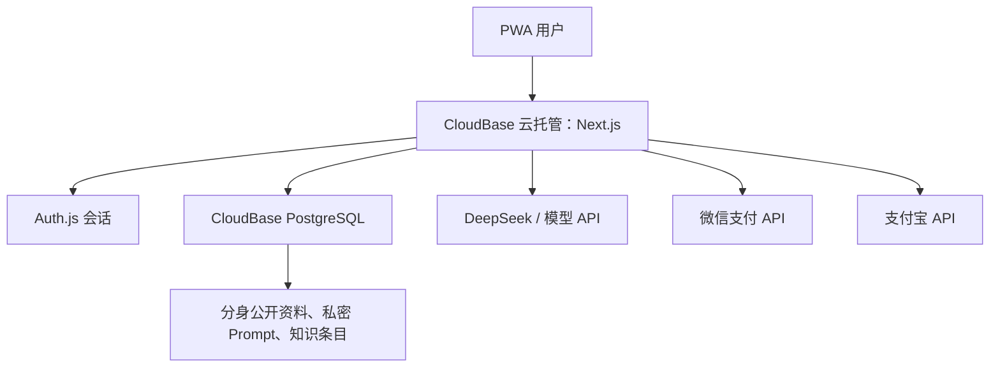

# AI Career Companion：CloudBase PostgreSQL 交接与实施文档

**版本：** v1.1  
**日期：** 2026-08-15  
**依据：** 最新 PWA 源码包 `ai-career-companion-pwa.zip`、AI Career Companion PRD V1.0  
**用途：** 交付 Trae，指导现有 Next.js PWA 从本地 SQLite 迁移至腾讯云 CloudBase PostgreSQL，并部署到 CloudBase 云托管  

---

## 一、结论先行

当前项目不是“纯 HTML + 原生 JS 静态 PWA”，而是一套完整的 **Next.js 14 App Router 服务端应用**：页面、Auth.js 登录、Prisma 数据访问、AI 模型调用、支付回调和用户权限判断都集中在同一个项目中。因此，正确的腾讯云交接方式不是把前端上传到静态托管后让浏览器直接调用 `rdb()`，而是：

1. 保留 Next.js、Auth.js、Prisma 和现有 API Routes；
2. 将 Prisma 的数据源从 SQLite 改为 CloudBase PostgreSQL；
3. 将 Next.js 以 `standalone` 容器部署到 CloudBase 云托管；
4. 云托管通过 PostgreSQL 协议从服务端直连数据库；
5. 浏览器仍只访问 `/api/*`，不直接访问业务数据库；
6. 导师全部是 AI 导师分身，没有导师账户，也没有导师侧数据权限；
7. 将导师分身公开资料、私密 Prompt 和知识条目从 `src/lib/mentors.ts` 拆分后迁入数据库；
8. 导师分身 Prompt 只能由服务端读取，不能序列化到浏览器、不能通过公开 API 或前端数据库 SDK 返回；
9. 第一阶段只完成“数据库和部署交接”，暂不同时将 Auth.js 改成 CloudBase Auth；
10. CloudBase Auth 手机验证码登录若仍要采用，应作为第二阶段单独迁移。
11. 支付层改成微信支付与支付宝双渠道，但订单、订阅生效和幂等处理必须共用一套服务端核心逻辑；
12. 用户可以反复更新个人档案，数据库保留每次修改后的完整版本和差异摘要；普通“编辑档案”不提供抹除历史的能力；
13. P2 再增加账号注销流程，仅面向从未付费的登录用户，或付费服务期已经结束且不存在未结事项的历史付费用户。

这一路线能最大限度保留已经完成的 PWA 功能，减少一次性重写认证、会话、数据库和前端状态所带来的上线风险。

---

## 二、当前代码审计结果

### 2.1 技术栈

| 层级 | 当前实现 |
|---|---|
| Web 框架 | Next.js 14.2，App Router，React 18，TypeScript |
| UI | Tailwind CSS |
| PWA | `public/manifest.json` + 自定义 `public/sw.js` |
| 认证 | Auth.js v5 beta + Credentials Provider + JWT Session |
| ORM | Prisma 5.22 |
| 开发数据库 | SQLite，`DATABASE_URL="file:./dev.db"` |
| AI | Next.js Route Handler 服务端调用 DeepSeek/OpenAI 兼容接口 |
| 导师分身 | `src/lib/mentors.ts` 中的静态 TypeScript 常量 |
| 支付 | 微信支付 H5 已有雏形；支付宝仅有环境变量占位，尚未实现；现有 Mock 分支和微信生产验签均未完成 |
| 部署形态 | `next.config.js` 已设置 `output: 'standalone'`，适合 CloudBase 云托管 |

### 2.2 当前数据库模型

现有 Prisma Schema 已包含：

- `User`
- `Account`
- `Session`
- `VerificationToken`
- `VerificationCode`
- `UserProfile`
- `UserProfileRevision`（本次新增）
- `PaymentOrder`
- `PaymentTransaction`（本次新增）
- `Subscription`
- `ChatSession`
- `ChatMessage`

这说明当前项目已经具备较完整的业务数据库骨架，不应退回到仅有 `students / mentors / conversations / messages` 四张表的简化设计。

### 2.3 当前导师分身结构

`src/lib/mentors.ts` 内共有 12 个分身 UID：

```text
ai-guide, lydia, james, sarah, marcus, lily,
david, emma, kevin, grace, tony, jenny
```

每个分身目前包含：

- 稳定 UID；
- 展示名称；
- 头像 URL；
- 标题、行业、标签、介绍语；
- 收费信息与是否免费；
- `personalityPrompt`；
- `knowledgeEntries`；
- `suggestedQuestions`。

其中 UID 是业务对象标识，不是登录账号，也不对应 `auth.users`。数据库中应命名为 `mentor_agent_uid` 或 `agent_uid`，避免被误解为真人导师用户 ID。

### 2.4 当前真实数据流

| 流程 | 当前数据流 |
|---|---|
| 登录 | 浏览器 → Auth.js Credentials → Prisma `User` → Auth.js JWT Cookie |
| 获取/更新用户档案 | 浏览器 → `/api/user/profile` → Auth.js 鉴权 → Prisma；更新时同一事务写入当前快照和历史版本 |
| AI 对话 | 浏览器 → `/api/chat` → Auth.js 鉴权 → 读取静态分身 Prompt → 调用模型 → Prisma 保存消息 |
| 历史会话 | 浏览器 → `/api/chat/sessions*` → Auth.js 鉴权 → Prisma |
| 档案提取 | `/api/profile/extract` 读取 AI 职导会话 → 调用模型 → `UserProfile` |
| 订阅与支付 | 浏览器 → `/api/payment/*` → 服务端按渠道调用微信支付或支付宝 → 统一支付核心更新订单和订阅 |

因此，CloudBase PostgreSQL 应当替换当前 SQLite 的存储位置，而不是取代 Next.js API 层。

---

## 三、目标架构



关键边界：

- 浏览器只获得分身公开资料；
- 私密 Prompt、知识条目全文和模型密钥只存在于服务端；
- 用户只能通过经过 Auth.js 校验的 API Routes 操作自己的数据；
- Prisma 连接凭据只保存在云托管环境变量中；
- 数据库不向浏览器提供直接连接；
- 若数据库和云托管支持同地域、同 VPC 内网访问，应优先使用内网地址。

---

## 四、认证与 RLS 决策

### 4.1 第一阶段保留 Auth.js

当前所有用户 ID、会话 Cookie、API 鉴权、支付归属、聊天归属都基于 `User.id` 和 Auth.js JWT。若在数据库迁移的同时改成 CloudBase Auth，将同时改变：

- 用户 ID 来源；
- 注册和登录页面；
- Cookie 与 Session；
- 所有 API Route 的鉴权方式；
- Prisma 数据关联；
- 支付订单用户归属；
- 既有用户迁移方式；
- `auth.uid()` 和 RLS 的身份上下文。

因此，第一阶段明确采用：

> **Auth.js 继续负责认证，CloudBase PostgreSQL 只作为服务端数据库。**

### 4.2 第一阶段不使用浏览器 `app.rdb()`

浏览器不会直接访问数据库，因此：

- 不安装或调用 `@cloudbase/js-sdk` 的 `app.rdb()`；
- 不把数据库权限交给 `authenticated` 前端角色；
- 不依赖 `auth.uid()`；
- 用户数据隔离继续由 API Route 中的 `session.user.id` 条件实现；
- 数据库层使用独立的 migration role 和 runtime role 做最小授权。

如果服务端 Prisma 使用的是表所有者账号，即使启用 RLS，表所有者通常也可能绕过 RLS；盲目生成一套 `auth.uid()` Policy 不会给当前 Auth.js 架构增加真实保护，反而会制造“已经安全”的错觉。

### 4.3 第二阶段可选：迁移 CloudBase Auth

若产品最终必须使用 CloudBase 手机验证码登录，应另建独立任务，完成：

1. 确认 CloudBase 环境地域支持短信验证码；
2. 将注册、登录、忘记密码从 Auth.js Credentials 改为 CloudBase Auth；
3. 决定是否保留本地 `User` 表作为业务用户映射；
4. 增加 `cloudbase_auth_user_id varchar(64) unique`；
5. 建立旧 `User.id` 与 CloudBase Auth UID 的一次性映射；
6. 修改所有 API Routes 的 token 校验；
7. 最后才评估是否让部分低风险表通过 `rdb()` + RLS 直连。

该阶段不得与第一阶段合并发布。

---

## 五、目标数据模型

### 5.1 保留的现有模型

以下模型继续保留，但切换到 PostgreSQL 类型：

- `User`
- `Account`
- `Session`
- `VerificationToken`
- `VerificationCode`
- `UserProfile`
- `UserProfileRevision`
- `PaymentOrder`
- `PaymentTransaction`
- `Subscription`
- `ChatSession`
- `ChatMessage`

### 5.2 新增导师分身模型

建议至少新增三个模型，将公开资料、私密 Prompt、知识内容彻底分开。

```prisma
model MentorAgent {
  uid                String   @id @db.VarChar(64)
  displayName        String   @map("display_name") @db.VarChar(100)
  avatarObjectPath   String?  @map("avatar_object_path") @db.VarChar(500)
  avatarUrl          String?  @map("avatar_url") @db.VarChar(1000)
  headline           String?  @db.VarChar(200)
  introduction       String   @db.Text
  industry           String?  @db.VarChar(100)
  tags               Json
  suggestedQuestions Json     @map("suggested_questions")
  accessTier         String   @default("FREE") @map("access_tier") @db.VarChar(30)
  priceFen           Int      @default(0) @map("price_fen")
  isActive           Boolean  @default(true) @map("is_active")
  sortOrder          Int      @default(0) @map("sort_order")
  createdAt          DateTime @default(now()) @map("created_at") @db.Timestamptz(3)
  updatedAt          DateTime @updatedAt @map("updated_at") @db.Timestamptz(3)

  promptVersions     MentorAgentPromptVersion[]
  knowledgeEntries   MentorKnowledgeEntry[]
  chatSessions       ChatSession[]

  @@index([isActive, sortOrder])
  @@map("mentor_agents")
}

model MentorAgentPromptVersion {
  id             String   @id @default(cuid())
  mentorAgentUid String   @map("mentor_agent_uid") @db.VarChar(64)
  version        Int
  systemPrompt   String   @map("system_prompt") @db.Text
  status         String   @default("DRAFT") @db.VarChar(20)
  changeNote     String?  @map("change_note") @db.VarChar(500)
  publishedAt    DateTime? @map("published_at") @db.Timestamptz(3)
  createdAt      DateTime @default(now()) @map("created_at") @db.Timestamptz(3)

  mentorAgent MentorAgent @relation(fields: [mentorAgentUid], references: [uid], onDelete: Cascade)
  chatSessions ChatSession[]

  @@unique([mentorAgentUid, version])
  @@index([mentorAgentUid, status, version])
  @@map("mentor_agent_prompt_versions")
}

model MentorKnowledgeEntry {
  id             String   @id @default(cuid())
  mentorAgentUid String   @map("mentor_agent_uid") @db.VarChar(64)
  category       String   @db.VarChar(100)
  content        String   @db.Text
  keywords       Json
  status         String   @default("PUBLISHED") @db.VarChar(20)
  version        Int      @default(1)
  createdAt      DateTime @default(now()) @map("created_at") @db.Timestamptz(3)
  updatedAt      DateTime @updatedAt @map("updated_at") @db.Timestamptz(3)

  mentorAgent MentorAgent @relation(fields: [mentorAgentUid], references: [uid], onDelete: Cascade)

  @@index([mentorAgentUid, status])
  @@map("mentor_knowledge_entries")
}
```

说明：

- `MentorAgent.uid` 使用当前稳定字符串，如 `lydia`、`ai-guide`；
- `avatarObjectPath` 保存对象存储内部路径，避免业务表只保存不可迁移的第三方 URL；
- `avatarUrl` 可作为当前兼容字段，但正式卡通照应迁移到腾讯云存储；
- `systemPrompt` 绝不能出现在任何公开 DTO 中；
- Prompt 每次修改生成新版本，不直接覆盖已发布版本；
- 会话记录具体使用了哪个 Prompt 版本，便于以后复现回答和质量审计。

### 5.3 修改聊天会话

```prisma
model ChatSession {
  id              String   @id @default(cuid())
  userId          String   @map("user_id")
  mentorAgentUid  String   @map("mentor_agent_uid") @db.VarChar(64)
  promptVersionId String?  @map("prompt_version_id")
  title           String?  @db.VarChar(200)
  messageCount    Int      @default(0) @map("message_count")
  createdAt       DateTime @default(now()) @map("created_at") @db.Timestamptz(3)
  updatedAt       DateTime @updatedAt @map("updated_at") @db.Timestamptz(3)

  user          User                      @relation(fields: [userId], references: [id], onDelete: Cascade)
  mentorAgent   MentorAgent               @relation(fields: [mentorAgentUid], references: [uid], onDelete: Restrict)
  promptVersion MentorAgentPromptVersion? @relation(fields: [promptVersionId], references: [id], onDelete: SetNull)
  messages      ChatMessage[]

  @@index([userId, mentorAgentUid, updatedAt])
  @@map("chat_sessions")
}
```

### 5.4 修改聊天消息

```prisma
model ChatMessage {
  id               String   @id @default(cuid())
  chatSessionId    String   @map("chat_session_id")
  sequenceNo       Int      @map("sequence_no")
  role             String   @db.VarChar(20)
  content          String   @db.Text
  promptTokens     Int?     @map("prompt_tokens")
  completionTokens Int?     @map("completion_tokens")
  totalTokens      Int?     @map("total_tokens")
  modelUsed        String?  @map("model_used") @db.VarChar(100)
  providerRequestId String? @map("provider_request_id") @db.VarChar(200)
  createdAt        DateTime @default(now()) @map("created_at") @db.Timestamptz(3)

  chatSession ChatSession @relation(fields: [chatSessionId], references: [id], onDelete: Cascade)

  @@unique([chatSessionId, sequenceNo])
  @@index([chatSessionId, createdAt])
  @@map("chat_messages")
}
```

AI 对话没有真人收件人，因此不需要 `is_read`、`read_at`、导师登录 ID 或导师侧权限。

### 5.5 用户档案与修改历史

用户可以更新所有允许编辑的档案字段，但“随便更新”不等于直接操作数据库任意列。服务端仍需校验字段白名单、长度、格式和枚举值；`userId`、版本号、审计时间等系统字段不可由客户端修改。

数据库采用“当前快照 + 追加式历史”结构：

```prisma
model UserProfile {
  id        String   @id @default(cuid())
  userId    String   @unique @map("user_id")
  version   Int      @default(1)
  // 现有业务字段继续保留，此处省略
  createdAt DateTime @default(now()) @map("created_at") @db.Timestamptz(3)
  updatedAt DateTime @updatedAt @map("updated_at") @db.Timestamptz(3)

  user      User                  @relation(fields: [userId], references: [id], onDelete: Cascade)
  revisions UserProfileRevision[]

  @@map("user_profiles")
}

model UserProfileRevision {
  id            String   @id @default(cuid())
  userId        String   @map("user_id")
  profileId     String   @map("profile_id")
  version       Int
  snapshot      Json
  changedFields Json     @map("changed_fields")
  source        String   @default("USER_EDIT") @db.VarChar(30)
  requestId     String?  @map("request_id") @db.VarChar(100)
  createdAt     DateTime @default(now()) @map("created_at") @db.Timestamptz(3)

  user    User        @relation(fields: [userId], references: [id], onDelete: Restrict)
  profile UserProfile @relation(fields: [profileId], references: [id], onDelete: Restrict)

  @@unique([profileId, version])
  @@unique([userId, requestId])
  @@index([userId, createdAt])
  @@map("user_profile_revisions")
}
```

更新规则：

1. 首次创建档案时写入 `version = 1` 的历史快照；
2. 每次更新在同一数据库事务内锁定/校验当前版本、计算字段差异、插入新版本，再更新 `UserProfile` 当前快照；
3. AI 自动提取写档案时也必须产生版本，`source = AI_EXTRACT`；用户手动修改使用 `USER_EDIT`；迁移脚本使用 `MIGRATION`；
4. 历史记录只追加，不允许用户 UPDATE/DELETE；查看旧版本或“恢复”旧版本时，实际创建一个新的版本，不能覆盖历史；
5. API 支持乐观并发控制，客户端提交 `expectedVersion`，版本冲突返回 `409`；
6. 普通档案编辑不再提供“删除档案并抹去历史”按钮。个人信息删除/匿名化由 P2 账号注销流程统一处理，并受必要的合规留存约束。

### 5.6 微信支付与支付宝双渠道

`PaymentOrder` 表示业务订单，不能与某个支付渠道绑定死。每次向渠道发起支付或换渠道重试，写入独立的 `PaymentTransaction`：

```prisma
model PaymentTransaction {
  id                  String    @id @default(cuid())
  paymentOrderId      String    @map("payment_order_id")
  provider            String    @db.VarChar(20) // WECHAT | ALIPAY
  providerTradeNo     String?   @map("provider_trade_no") @db.VarChar(100)
  merchantRequestId   String    @unique @map("merchant_request_id") @db.VarChar(100)
  amountFen           Int       @map("amount_fen")
  status              String    @default("CREATED") @db.VarChar(30)
  notifyVerifiedAt    DateTime? @map("notify_verified_at") @db.Timestamptz(3)
  paidAt              DateTime? @map("paid_at") @db.Timestamptz(3)
  sanitizedMetadata   Json?     @map("sanitized_metadata")
  createdAt           DateTime  @default(now()) @map("created_at") @db.Timestamptz(3)
  updatedAt           DateTime  @updatedAt @map("updated_at") @db.Timestamptz(3)

  paymentOrder PaymentOrder @relation(fields: [paymentOrderId], references: [id], onDelete: Restrict)

  @@unique([provider, providerTradeNo])
  @@index([paymentOrderId, status])
  @@map("payment_transactions")
}
```

实现要求：

- 前端只选择 `WECHAT` 或 `ALIPAY`，金额、商品、用户和服务期全部由服务端从订单读取；
- 分别实现 `WechatPayProvider` 和 `AlipayProvider`，但二者回调验证成功后必须汇入同一个 `markOrderPaid()` 事务；
- 支付宝同步跳转页只用于用户体验，不能作为付款成功依据；异步通知验签成功、金额/商户/应用/订单状态一致后才可生效订阅；
- 微信和支付宝回调都必须幂等；重复通知、乱序通知或用户切换渠道不能重复开通服务；
- 私钥、平台公钥/证书、AppID、商户号只存云托管 Secret/环境变量，不入 Git、不进入客户端；
- 生产缺配置必须 fail closed，Mock 支付必须显式关闭；
- 支付手续费不是腾讯云租金，按各商户与微信/支付宝签约的实际费率另算：`手续费 = 微信渠道 GMV × 微信签约费率 + 支付宝渠道 GMV × 支付宝签约费率`。

### 5.7 P2：账号注销（本期只预留，不在 P0/P1 上线）

P2 允许以下用户发起注销：

- 已登录且从未形成成功付款订单的用户；
- 曾经成功付款，但所有付费服务期均已结束的用户。

以下情形暂不允许自动注销：仍在付费服务期、存在待支付/退款/拒付/争议订单、存在未结束的自动续费或其他法定/运营待处理事项。前端应解释阻断原因，而不是静默失败。

建议新增 `AccountClosureRequest`，状态至少包含 `REQUESTED / COOLING_OFF / CANCELLED / EXECUTING / COMPLETED / ON_HOLD`。流程包括重新认证、资格检查、取消自动续费、可配置冷静期、再次确认、执行去标识化/删除、撤销会话与令牌、记录不含多余个人信息的完成凭证。支付、财税、风控或争议处理所需记录的保留范围与期限必须在上线前单独完成合规评审；不能因为注销而破坏订单账务完整性。

P0/P1 只需保证数据模型不会阻碍未来注销，并在隐私说明中准确写明“账号注销将在 P2 提供”，不得提前展示可点击但无效的入口。

### 5.8 PostgreSQL 类型修订

迁移时同时完成以下修订：

| 当前字段 | 当前问题 | PostgreSQL 目标 |
|---|---|---|
| 多个数组字段保存为 JSON 字符串 | 查询、校验和迁移困难 | Prisma `Json` / PostgreSQL `jsonb` |
| `PaymentOrder.amount Float` | 金额存在浮点误差 | `amountFen Int`，统一保存人民币分 |
| 单一 `paymentMethod` 字段 | 无法表达换渠道重试、多次通知和渠道流水 | `PaymentOrder` + `PaymentTransaction` 一对多 |
| `UserProfile` 只有当前值 | 修改后无法审计或恢复 | 当前快照 + `UserProfileRevision` 追加式版本 |
| `VerificationCode.code` | 明文验证码 | `codeHash`，只存哈希；或第二阶段改用 CloudBase Auth 后删除 |
| `ChatSession.mentorId` | 只指向代码常量，无外键 | `mentorAgentUid` 外键关联 `mentor_agents.uid` |
| `messageCount` | 多步写入失败时可能漂移 | 同一事务更新，或查询时统计；不得独立非事务递增 |
| 日期时间 | SQLite 语义较弱 | PostgreSQL `timestamptz(3)` |

---

## 六、上线前阻断项

以下问题在当前源码中已经存在，必须在生产迁移前修复。

### P0-1：导师 Prompt 可能进入浏览器

`src/app/chat/page.tsx`、导师详情页等服务端组件取得完整 `Mentor` 对象后，将其传给客户端组件 `MentorChat`。完整对象中含有 `personalityPrompt` 和 `knowledgeEntries`，Next.js 可能将这些字段序列化进客户端数据。

修复要求：

- 定义 `PublicMentorAgentDTO`，只包含公开展示字段和推荐问题；
- 客户端组件只能接收 DTO；
- Prompt 和知识内容仅由 `/api/chat` 服务端查询；
- 构建完成后搜索 `.next/static` 和返回 HTML，确认不存在 Prompt 特征文本。

### P0-2：聊天接口未验证传入会话归属

`POST /api/chat` 接受客户端传来的 `sessionId`，保存消息前没有再次验证该会话属于 `session.user.id`，也没有验证会话绑定的分身与本次 `mentorId` 相同。

修复要求：

```text
若传入 sessionId：
1. 查询 chat_session；
2. 必须满足 session.user_id = 当前用户；
3. 必须满足 session.mentor_agent_uid = 请求 mentorAgentUid；
4. 任一不满足返回 404 或 403；
5. 之后才允许写入消息。
```

### P0-3：客户端控制整段模型上下文

当前客户端把完整 `messages` 历史提交给 `/api/chat`，服务端直接交给模型。用户可修改浏览器请求，伪造 assistant 历史、绕过问卷状态或污染上下文。

修复要求：

- 客户端只提交 `sessionId`、`mentorAgentUid` 和本轮 `userMessage`；
- 服务端从数据库加载该用户、该会话最近 N 条消息；
- 服务端决定哪些历史进入模型；
- system 消息永远由服务端生成；
- 对话保存、配额扣减和会话计数放入数据库事务。

### P0-4：验证码接口直接返回验证码

`/api/auth/send-code` 和 `/api/auth/reset-password/send` 当前都会把验证码直接返回给浏览器，而且验证码在数据库中明文保存。该实现只能用于本地演示。

生产前必须二选一：

- 接入真实短信/邮件 Provider，并删除响应中的 `code`；或
- 禁用注册、找回密码入口，等待第二阶段 CloudBase Auth 迁移。

### P0-5：微信支付生产验签尚未实现，支付宝尚未接入

当前 `verifyNotifySignature()` 使用 API v3 密钥计算 HMAC，这不是完整的微信支付平台证书/公钥验签流程；同时缺少支付配置时会自动进入 Mock 模式，属于生产环境“配置缺失仍继续运行”。

修复要求：

- 生产环境必须 fail closed：缺任一支付配置即启动失败或支付接口返回 503；
- 使用微信支付平台证书或平台公钥完成官方 RSA 验签；
- 核验回调金额、商户号、AppID、订单状态和幂等性；
- 按 5.6 的渠道抽象新增支付宝 Provider、异步通知验签和统一订单入账事务；
- 支付宝回跳页不得直接修改订单或订阅状态；
- 生产环境彻底关闭 `/payment/mock` 与 `/api/payment/mock-pay`；
- 任一渠道未完成正式验签和沙箱联调前，不开放该渠道真实支付。

### P0-6：Service Worker 会缓存登录后的页面

当前 `sw.js` 对所有页面导航使用 Network First，并将成功响应写入页面缓存。这可能缓存 `/dashboard`、`/history`、用户档案和其他个性化 HTML。

修复要求：

- 只缓存明确列出的公共页面与静态资源；
- `/dashboard`、`/history`、`/chat`、`/payment`、`/api/*` 一律 Network Only；
- 退出登录时通知 Service Worker 清理所有页面缓存；
- 私人对话不写 Cache API。

### P0-7：完整聊天内容写入 localStorage

`MentorChat` 将每个用户与每个分身的完整消息历史保存到 `localStorage`。共享设备、浏览器扩展、XSS 或退出登录后的本地残留都会增加隐私风险，而且数据库删除与本地副本不会自动同步。

修复要求：

- PostgreSQL 成为唯一权威消息源；
- localStorage 最多保存未发送草稿、当前 `sessionId` 和无敏感性的 UI 状态；
- 登录、退出、删除会话和账号删除时清理旧键；
- 不在浏览器持久化完整历史。

### P0-8：隐私承诺与现有功能不一致

AI 职导欢迎语声称用户可以修改或删除记录，但当前 API 没有完整的版本化修改、数据导出、删除会话或删除账号能力。新的产品规则是：

- P0/P1 提供个人档案反复更新，并保留每次修改历史；
- 普通档案编辑不提供删除历史的能力；
- P2 才提供符合资格的账号注销；
- 上线前必须同步修改欢迎语、隐私说明和设置页，准确说明现阶段已提供和未提供的能力，不能继续承诺“随时删除档案或账号”。

### P0-9：档案更新尚未形成可审计事务

当前用户手动更新或 AI 提取档案只会覆盖 `UserProfile` 当前值。迁移时必须按 5.5 新增历史表，并保证当前快照、历史版本和版本号在同一事务中提交；任何一个步骤失败都必须整体回滚。历史 API 只能读取当前用户自己的版本，不得接受客户端传入任意 `userId`。

### P1 项目

- 内存 `Map` 限流只适用于单实例，云托管多实例需改为 Redis、数据库原子计数或腾讯云网关限流；
- 免费试用逻辑存在冲突：非会员对收费分身会被后续订阅检查直接拦截，免费次数实际上无法正常生效；
- `prisma/seed.ts` 含固定测试账号密码，禁止在生产执行；
- 当前没有 `prisma/migrations/`，生产不能继续使用 `prisma db push`；
- PWA manifest 引用了 `/icon-192.png` 和 `/icon-512.png`，压缩包中没有这两个文件；
- CSP 仍包含 `'unsafe-inline'` 和 `'unsafe-eval'`，正式构建后应逐步收紧；
- 当前只有 Lydia 使用第三方头像 URL，其余分身头像为空，需统一迁移卡通照资源；
- 模型 Key 未配置时 `/api/chat` 应明确失败，不得发送 `Bearer undefined`；
- 当前配置中的 `deepseek-chat` 已不应作为 2026-08 上线模型名，部署前改为当前官方模型名（本稿按 `deepseek-v4-flash` 估算），并完成输出质量、Token 上限和费用回归测试；
- 档案中的职业焦虑、学校、城市、对话历史属于个人信息，应明确保存期限、删除机制和日志脱敏规则。
- P2 注销功能上线前应完成资格规则、冷静期、数据分类、必要留存和去标识化的合规评审。

---

## 七、数据库交接实施顺序

### 阶段 0：建立 staging，不碰生产数据

1. 在 CloudBase PostgreSQL 中准备独立 staging 数据库或独立 schema；
2. 创建 migration 账号和 runtime 账号；
3. runtime 账号不得拥有建表、删表、修改 schema 权限；
4. 记录 CloudBase 控制台提供的主机、端口、数据库名、SSL 和网络要求；
5. 云托管与数据库处于同地域时优先配置 VPC 内网连接；
6. 不在聊天、代码、截图或 Git 中传递真实数据库密码。

### 阶段 1：将 Prisma Schema 转为 PostgreSQL

将 datasource 改为：

```prisma
datasource db {
  provider = "postgresql"
  url      = env("DATABASE_URL")
  directUrl = env("DIRECT_URL")
}
```

注意：是否需要分别使用连接池 URL 与直连 URL，必须以 CloudBase 控制台实际提供的连接方式为准，不得猜测地址、端口或 SSL 参数。

同时完成第五章所列的数据类型调整、分身模型、`UserProfileRevision` 和 `PaymentTransaction`，并为 P2 注销预留可扩展的数据关系；本期不要创建会误导用户的假注销入口。

### 阶段 2：生成可审计 migration

禁止在生产使用：

```bash
prisma db push
prisma migrate reset
```

正确流程：

```bash
# 只在本地或 staging 开发数据库生成 migration
npx prisma migrate dev --name cloudbase_postgresql_baseline

# 检查状态
npx prisma migrate status

# 生产只应用已经提交、审阅过的 migration
npx prisma migrate deploy
```

Trae 必须先输出 migration SQL 供人工 review，确认后才能在 staging 执行；staging 验收通过后，再申请生产执行。

### 阶段 3：迁移导师分身数据

编写一次性脚本，将 `src/lib/mentors.ts` 中 12 个分身转换为：

- `mentor_agents` 公开资料；
- `mentor_agent_prompt_versions` 的 v1 已发布 Prompt；
- `mentor_knowledge_entries` 知识条目。

迁移完成后验证：

- 分身总数为 12；
- UID 无重复；
- 每个分身恰有一个 v1 Prompt；
- 现有知识条目总数与源码一致；
- `ai-guide` 保持免费；
- UI 排序与当前页面一致；
- 公开 DTO 中不含 Prompt 和知识全文。

迁移验证完成后，删除生产运行路径对 `src/lib/mentors.ts` 的依赖；可以暂时保留该文件作为只读迁移来源，但不得继续作为线上配置源。

### 阶段 4：决定是否迁移本地 SQLite 数据

压缩包没有包含 `dev.db`，所以无法确认本地是否存在需要保留的真实用户数据。执行前必须确认：

- 若全是测试数据：不迁移用户、订单和聊天，只初始化分身；
- 若存在真实数据：先脱敏备份，再编写显式 ETL，不能直接把 SQLite dump 当成 PostgreSQL SQL 执行。

真实数据迁移至少校验：

- 用户数；
- 用户档案数；
- 会话数；
- 消息数；
- 订单数和各状态金额合计；
- 订阅数；
- 外键孤儿数必须为 0；
- 每个会话的消息顺序一致。

### 阶段 5：修改服务端查询

需要修改的核心文件：

- `src/lib/mentors.ts`：拆成 server-only repository 和公开 DTO；
- `src/app/api/chat/route.ts`：从数据库读取分身 Prompt、版本与知识；
- `src/app/api/chat/sessions/route.ts`：校验分身是否存在和是否启用；
- `src/app/api/chat/sessions/latest/route.ts`：沿用用户归属过滤；
- `src/app/api/chat/sessions/[id]/messages/route.ts`：继续强制用户归属；
- `src/app/chat/page.tsx`、`src/app/mentors/*`、`src/app/dashboard/page.tsx`、`src/app/history/page.tsx`：只读取公开 DTO；
- `src/components/mentor-chat.tsx`：不再持久化完整消息历史，不再提交完整历史；
- `public/sw.js`：不缓存私人页面；
- 认证与支付文件：按第六章修复阻断项。
- 用户档案 API：加入字段白名单、`expectedVersion`、事务化历史写入和仅本人可读的版本列表；
- 支付 API：拆分微信/支付宝 Provider，并汇入统一订单状态机。

### 阶段 6：事务与并发

单轮成功对话的数据库写入至少包含：

1. 校验会话归属；
2. 插入用户消息；
3. 插入 AI 回复；
4. 更新消息计数或用量账本；
5. 必要时扣减免费次数。

能够放在一个事务中的写操作必须使用 `prisma.$transaction()`。模型 API 是外部网络调用，不应长时间占用数据库事务；推荐流程为：

```text
短事务 A：验证并写入用户消息/请求状态
→ 调用模型
→ 短事务 B：写入 AI 回复、Token 用量、会话更新时间和配额事件
```

还应增加幂等请求 ID，避免客户端重试造成同一条用户消息重复扣费或重复保存。

---

## 八、数据库账号与权限

建议使用两个数据库账号：

| 账号 | 用途 | 权限 |
|---|---|---|
| migration role | CI/CD 执行 `prisma migrate deploy` | schema 变更权限，仅发布阶段使用 |
| runtime role | Next.js 日常运行 | 仅业务表必要的 SELECT/INSERT/UPDATE/DELETE 与 sequence 权限 |

要求：

- 从默认 `PUBLIC` 撤销不必要的 schema 创建权限；
- runtime role 不得 DROP TABLE、ALTER TABLE 或创建扩展；
- Prompt 表只允许服务端 runtime role 与管理后台角色读取；
- 数据库地址优先内网访问；
- 公网连接如必须开启，应限制来源、强制符合控制台要求的 SSL，并及时关闭临时白名单；
- migration 密码和 runtime 密码分开轮换；
- 应用日志不得打印连接字符串、密码、完整 Prompt、完整用户对话或支付回调敏感字段。

本阶段不为浏览器角色授予任何业务表权限。

---

## 九、云托管部署方案

### 9.1 为什么使用云托管而不是静态托管

当前应用包含 SSR、Auth.js、Prisma、模型调用、支付通知和多个 API Route。CloudBase 官方对 Next.js 14+ App Router 的推荐路线是 `output: 'standalone'` + Dockerfile + 云托管。静态网站托管无法运行这些服务端能力。

### 9.2 需要新增的 Dockerfile

使用多阶段构建，并确保复制：

- `.next/standalone`；
- `.next/static`；
- `public/`；
- Prisma 生成客户端所需的运行时文件。

容器必须：

- Node.js 版本与 Next.js/Prisma 兼容；
- `HOSTNAME=0.0.0.0`；
- `PORT=3000`；
- 非 root 用户运行；
- 不把 `.env*` COPY 进最终镜像；
- 在构建阶段运行 `prisma generate`；
- 不在每个容器启动时自动执行 destructive migration。

### 9.3 生产环境变量

至少配置：

```text
NODE_ENV=production
DATABASE_URL=<runtime connection string>
DIRECT_URL=<migration/direct connection string, only where required>
AUTH_SECRET=<strong random secret>
AUTH_TRUST_HOST=true
NEXTAUTH_URL=https://<production-domain>
DEEPSEEK_API_KEY=<server secret>
AI_API_URL=https://api.deepseek.com/v1
AI_MODEL=deepseek-v4-flash
FREE_TRIAL_COUNT=3
RATE_LIMIT_PER_MINUTE=10
WXPAY_APP_ID=<server secret/config>
WXPAY_MCH_ID=<server secret/config>
WXPAY_API_V3_KEY=<server secret>
WXPAY_SERIAL_NO=<server config>
WXPAY_PRIVATE_KEY=<server secret>
WXPAY_NOTIFY_URL=https://<production-domain>/api/payment/notify
WXPAY_H5_RETURN_URL=https://<production-domain>/payment/success
ALIPAY_APP_ID=<server config>
ALIPAY_PRIVATE_KEY=<server secret>
ALIPAY_PUBLIC_KEY_OR_CERT=<server secret/config>
ALIPAY_NOTIFY_URL=https://<production-domain>/api/payment/alipay/notify
ALIPAY_RETURN_URL=https://<production-domain>/payment/success
PAYMENT_MOCK_ENABLED=false
```

`DIRECT_URL` 是否需要出现在运行容器中取决于最终 migration 流程；若 migration 在独立 CI Job 中执行，日常运行容器不应持有 migration 账号密码。

### 9.4 部署命令框架

```bash
npm ci
npm run build
docker build -t ai-career-companion:local .
docker run --env-file <local-test-env> -p 3000:3000 ai-career-companion:local
tcb login
tcb cloudrun deploy --port 3000
```

命令中的环境 ID、服务名、VPC、子网和数据库连接值必须从控制台读取，不得由 Trae 猜测。

### 9.5 域名与路由

1. CloudBase 云托管 → 对应服务 → 确认默认域名可访问；
2. HTTP 访问服务/自定义域名 → 绑定已经备案的正式域名；
3. 选择覆盖该域名的 SSL 证书；
4. DNSPod 添加控制台给出的 CNAME；
5. 将 `/*` 路由到 Next.js 云托管服务；
6. 验证微信与支付宝各自的异步通知 URL 可被对应支付平台访问；
7. 不要再把同一产品的根路由同时指向静态托管和云托管；
8. 验证 HSTS、Cookie Secure、回调域名和 `NEXTAUTH_URL` 均使用正式 HTTPS 域名。

---

## 十、发布和回滚

### 发布前

1. 对生产数据库创建平台备份；
2. 额外执行一次逻辑备份：

```bash
pg_dump "$DATABASE_URL" --format=custom --no-owner --file=pre_release.dump
```

3. 在 staging 完整跑过 migration；
4. 检查 migration 是否含 DROP、TRUNCATE、不可逆类型收窄或长时间锁表；
5. 记录当前云托管版本；
6. 确认生产 Mock 验证码和 Mock 支付均不可达，并分别完成微信、支付宝沙箱/测试环境回调验签。

### 发布顺序

```text
数据库向后兼容 migration
→ 导入导师分身数据
→ 部署兼容新旧字段的应用版本
→ 数据校验
→ 切换读取新表
→ 观察日志和指标
→ 后续版本再删除旧字段或静态导师依赖
```

不要在一个 migration 中同时“新建字段、迁移所有数据、删除旧字段”。

### 回滚原则

- 应用异常：先将云托管流量切回上一稳定版本；
- migration 已执行：优先使用向前修复 migration，不直接手工改生产表；
- 数据损坏：根据平台备份或逻辑备份恢复到独立数据库，核验后再切换；
- Prompt 变更异常：将上一 Prompt 版本重新标记为发布版本，不覆盖历史记录。

---

## 十一、验收矩阵

### 数据库

- [ ] Prisma 能从云托管连接 CloudBase PostgreSQL；
- [ ] 连接使用正确的内网/SSL 配置；
- [ ] `prisma migrate status` 无 pending/failed migration；
- [ ] runtime 账号不能建表、删表或修改 schema；
- [ ] 12 个导师分身及各自 Prompt v1 已迁移；
- [ ] `ChatSession.mentorAgentUid` 外键生效；
- [ ] 金额统一为整数分；
- [ ] JSON 数组能正常读写；
- [ ] 用户档案当前快照与历史版本数量、版本号一致；
- [ ] 支付订单与微信/支付宝渠道流水是一对多关系；
- [ ] 数据库中不存在外键孤儿。

### 权限与隐私

- [ ] 用户 A 不能读取用户 B 的档案、会话、消息、订单；
- [ ] 修改请求中的 `sessionId` 不能向他人会话写入；
- [ ] 修改请求中的 `mentorAgentUid` 不能改变已有会话绑定分身；
- [ ] 客户端 HTML、RSC Payload、JS Bundle 和 API 响应中不存在 system Prompt；
- [ ] 浏览器 localStorage 中不存在完整聊天历史；
- [ ] Service Worker 不缓存档案、历史、支付和私人聊天页面；
- [ ] 退出登录后私人缓存已清理；
- [ ] 日志不包含数据库密码、模型 Key、完整 Prompt 或完整聊天内容。
- [ ] 用户只能查看和更新自己的档案，不能读取他人的历史版本；
- [ ] 旧版本不可修改或删除，“恢复”会生成新版本；
- [ ] UI 与隐私说明未承诺当前尚不存在的档案删除或账号注销能力。

### AI 对话

- [ ] 客户端只发送本轮消息，不发送可伪造的完整历史；
- [ ] 服务端从数据库加载历史；
- [ ] 同一请求重试不会重复扣次数或重复保存消息；
- [ ] 对话记录了实际使用的 Prompt 版本和模型；
- [ ] 模型失败时用户消息状态明确，可安全重试；
- [ ] 免费、付费和套餐配额测试通过。

### 认证与支付

- [ ] 生产验证码响应不包含验证码；
- [ ] 验证码不以明文保存；
- [ ] 生产 Mock 支付接口返回 404/403；
- [ ] 支付回调使用官方要求的证书/公钥验签；
- [ ] 回调重复发送不会重复创建订阅；
- [ ] 回调金额与数据库订单金额一致；
- [ ] 缺少支付密钥时系统拒绝支付，而不是进入 Mock。
- [ ] 用户可在微信与支付宝之间选择渠道，订单金额均由服务端确定；
- [ ] 支付宝异步通知完成官方验签，并核对 AppID、商户身份、金额、订单号和交易状态；
- [ ] 支付宝同步跳转不能直接把订单改成已支付；
- [ ] 同一订单换渠道、重复回调或回调乱序不会重复开通服务。

### 用户档案与 P2 预留

- [ ] 用户连续修改同一档案三次后，当前档案为最新版且可查询三个追加式版本；
- [ ] 两个设备同时更新时，过期版本请求返回 `409`，不会静默覆盖；
- [ ] AI 提取档案也产生 `AI_EXTRACT` 历史版本；
- [ ] P2 注销资格规则已写入产品待办，但 P0/P1 不展示无效入口；
- [ ] 数据关系可区分从未付费、服务期已结束、服务期内和存在未结支付事项的用户。

### PWA 和部署

- [ ] `/icon-192.png`、`/icon-512.png` 实际存在；
- [ ] manifest 和 Service Worker 均通过 HTTPS 加载；
- [ ] iPhone Safari 可“添加到主屏幕”；
- [ ] Android Chrome 可安装；
- [ ] `/_next/static/*`、`public/*` 无 404；
- [ ] 自定义域名、证书、CNAME 与 `NEXTAUTH_URL` 一致；
- [ ] 云托管日志、数据库连接数、API 错误率和模型失败率可查看。

---

## 十二、交给 Trae 的执行指令

下面的内容可以直接作为下一轮 Trae Prompt 使用：

```text
请基于当前 ai-career-companion 源码执行 CloudBase PostgreSQL 交接。不要重新生成 Demo，不要改成纯静态站，也不要让浏览器直接调用 rdb()。

当前架构必须保留：Next.js 14 App Router、Auth.js、Prisma、现有 API Routes、PWA 页面、AI 服务端调用和支付服务端调用。第一阶段只迁移数据库和部署，不迁移 CloudBase Auth。

先阅读《AI Career Companion：CloudBase PostgreSQL 交接与实施文档 v1.1》，然后严格分阶段工作：

第一阶段：只做代码审计和差异清单，不修改代码。逐项确认文档列出的 P0/P1 问题是否存在，并给出准确文件路径。

第二阶段：输出 PostgreSQL 版 Prisma schema 和 migration SQL 供 review，不执行数据库。要求新增 mentor_agents、mentor_agent_prompt_versions、mentor_knowledge_entries、user_profile_revisions、payment_transactions；ChatSession 使用 mentorAgentUid 外键并记录 promptVersionId；档案使用当前快照加追加式历史；支付订单与渠道流水分离；数组使用 Json/jsonb；金额使用整数分；时间使用 timestamptz。

第三阶段：输出 mentors.ts 到数据库的一次性迁移脚本和验证脚本，不执行。必须保证 12 个分身 UID、公开资料、Prompt v1、知识条目和推荐问题完整迁移。Prompt 只允许服务端读取。

第四阶段：先修复所有 P0 阻断项。尤其是：
1. 客户端不再获得 personalityPrompt 和 knowledgeEntries；
2. /api/chat 必须验证 sessionId 属于当前用户并匹配当前分身；
3. 客户端只发送本轮 userMessage，服务端从数据库加载历史；
4. 消息保存、计数和配额更新使用事务与幂等请求 ID；
5. localStorage 不保存完整聊天；
6. Service Worker 不缓存私人页面；
7. 生产验证码不返回 code，不明文保存验证码；
8. 生产 Mock 支付关闭；正式支付验签未完成时禁止开放对应渠道；
9. 新增支付宝渠道，微信和支付宝通过统一的订单状态机、幂等入账事务和订阅生效逻辑；
10. 用户可反复更新个人档案，每次手动更新或 AI 提取均在同一事务内产生不可覆盖的历史版本；
11. 纠正隐私说明：P0/P1 不承诺删除档案历史或账号注销，P2 再实现符合资格用户的注销流程。

第五阶段：生成 Dockerfile、.dockerignore、经过脱敏的 .env.example 和 CloudBase 云托管部署说明。使用 Next.js standalone，多阶段 Docker 构建，非 root 用户运行，复制 public 和 .next/static。所有 Secret 只通过云托管环境变量注入。

第六阶段：在本地和 staging 完成 build、migration、数据迁移、权限、档案版本并发、隐私、对话、微信/支付宝支付和 PWA 测试，并按文档中的验收矩阵提交报告。

每个阶段结束后停止，列出新增/修改文件、命令结果、风险和下一步，等待我明确确认后再进入下一阶段。禁止执行 prisma db push、prisma migrate reset、DROP、TRUNCATE 或任何生产数据库写操作。禁止猜测环境 ID、数据库地址、VPC、子网、密码、证书 ID 和域名。
```

---

## 十三、六个月费用估算

### 13.1 估算边界与假设

本估算用于六个月 MVP 验证期的现金预算，不是腾讯云最终报价。计算日期为 2026-08-15，地域按 CloudBase PostgreSQL 当前支持的上海环境，假设：

- 采用 CloudBase 标准版资源点计费，官方页面标价 199 元/月、330,000 资源点/月；
- CloudBase PostgreSQL 按最多 1 CU（1 核 CPU + 2 GB 内存）连续计费，容量按 10 GB；
- Next.js 云托管采用 0.25 核 + 0.5 GiB、最低 1 实例连续运行的保守上界；若允许缩容到 0，实际费用会更低，但首次请求存在冷启动；
- 每月外网出流量 10 GB、HTTP 网关调用 10 万次、日志写入和平均留存各 5 GB、对象存储 2 GB；
- 六个月共 1,000 条国内验证码短信作为首批采购量；
- AI 费用按 DeepSeek V4 Flash 当前官方单价和真实 Token 用量另算；
- 域名、ICP 和 SSL 已准备，本文不重复计入；开发人力、支付手续费、退款、税费和合规咨询不属于“云资源租金”。

### 13.2 资源点消耗校验（月度保守上界）

| 项目 | 官方按量单价 | 月度假设 | 月度等价值 |
|---|---:|---:|---:|
| PostgreSQL CPU | 0.342 元/核·小时 | 1 核 × 730 小时 | 249.66 元 |
| PostgreSQL 容量 | 0.0005 元/GB·小时 | 10 GB × 730 小时 | 3.65 元 |
| 云托管 CPU | 0.055 元/核·小时 | 0.25 核 × 730 小时 | 10.04 元 |
| 云托管内存 | 0.032 元/GB·小时 | 0.5 GB × 730 小时 | 11.68 元 |
| 云托管外网流量 | 0.8 元/GB | 10 GB | 8.00 元 |
| HTTP 网关 | 0.03 元/万次 | 10 万次 | 0.30 元 |
| 日志 | 0.35 元/GB 写入；0.0115 元/GB·天存储 | 各 5 GB | 3.48 元 |
| 云存储 | 0.00394 元/GB·天 | 2 GB | 0.24 元 |
| **合计** |  |  | **约 287.05 元/月** |

月度保守资源等价值约 287,050 点，低于标准版的 330,000 点/月。也就是说，在上述假设成立并已切换到资源点计费的前提下，标准版套餐理论上可覆盖主要云资源。必须在控制台开启用量告警；超出套餐资源点后会使用资源包或按量计费。

### 13.3 六个月现金预算

| 费用项 | 六个月估算 | 是否建议预留 |
|---|---:|---|
| CloudBase 标准版 | 199 × 6 = **1,194 元** | 必选 |
| 国内短信 1,000 条 | 0.05 × 1,000 = **50 元** | 建议；套餐有效期覆盖六个月 |
| DeepSeek V4 Flash | **约 200–600 元预充值** | 随实际对话 Token 浮动 |
| 超量/日志/流量缓冲 | **300–500 元** | 建议，防止突发流量或日志失控 |
| **建议六个月准备金额** | **约 1,744–2,344 元，建议按 2,000–2,400 元准备** | 不含支付手续费与人力 |

AI 费用的可复核公式为：

```text
DeepSeek V4 Flash 费用
= 缓存命中输入 Token / 1,000,000 × 0.02 元
+ 缓存未命中输入 Token / 1,000,000 × 1 元
+ 输出 Token / 1,000,000 × 2 元
```

支付宝和微信支付手续费不应写成固定云租金。正式预算应在商户产品签约完成后，将各渠道后台显示的签约费率代入：

```text
六个月支付手续费
= 支付宝成功交易 GMV × 支付宝实际签约费率
+ 微信成功交易 GMV × 微信实际签约费率
```

若生产决定云托管缩容到 0、数据库 CPU 实际计量明显低于保守上界，个人版可能在非常低流量时更便宜；但个人版只有 40,000 点/月且无标准版的 14 天数据回档能力，不建议用作承载真实个人档案和支付订单的生产基线。最终下单前应在 CloudBase 控制台“套餐用量/购买页”再次核对地域、优惠与资源点规则。

---

## 十四、参考资料

- [CloudBase：把 Next.js 14+ App Router 应用部署到云托管](https://docs.cloudbase.net/recipes/deploy-nextjs-to-cloudbase-run)
- [CloudBase PostgreSQL：连接数据库](https://docs.cloudbase.net/database/postgresql/connecting-to-postgresql)
- [CloudBase PostgreSQL：连接管理](https://docs.cloudbase.net/database/postgresql/connection-management)
- [CloudBase：云托管服务环境变量](https://docs.cloudbase.net/run/deploy/service-setting)
- [CloudBase：密钥与环境变量分层管理](https://docs.cloudbase.net/recipes/secure-secrets-in-cloud-function)
- [CloudBase PostgreSQL：备份与恢复](https://docs.cloudbase.net/en/database/postgresql/backup)
- [CloudBase：资源点价格与套餐配额](https://cloud.tencent.com/document/product/876/127357)
- [腾讯云短信：国内短信价格总览](https://cloud.tencent.com/document/product/382/36132)
- [DeepSeek API：模型与价格](https://api-docs.deepseek.com/zh-cn/quick_start/pricing/)
- [Prisma：开发与生产 migration 工作流](https://www.prisma.io/docs/orm/prisma-migrate/workflows/development-and-production)
- [Prisma：生产环境部署 migration](https://www.prisma.io/docs/orm/prisma-client/deployment/deploy-database-changes-with-prisma-migrate)
- [Prisma：连接池](https://www.prisma.io/docs/orm/prisma-client/setup-and-configuration/databases-connections/connection-pool)

---

## 十五、明确不在本次交接中执行的事项

- 不直接连接或修改现有生产 CloudBase PostgreSQL；
- 不替用户决定是否迁移 CloudBase Auth；
- 不执行真实支付；
- 不代替商户签约或假设微信、支付宝的实际交易费率；
- 不上传真实密钥；
- 不删除本地 SQLite 或现有导师配置；
- 不把导师分身当作真人登录用户；
- 不建立导师侧页面或导师侧 RLS；
- 不在没有 staging 验证和备份的情况下发布 migration。
- 不在 P0/P1 提前上线账号注销；P2 实施前需另行确认产品与合规规则。

本文件是下一阶段实施基准。若 Trae 的建议与本文件关键边界冲突，应先报告冲突并等待确认，不能直接执行。
